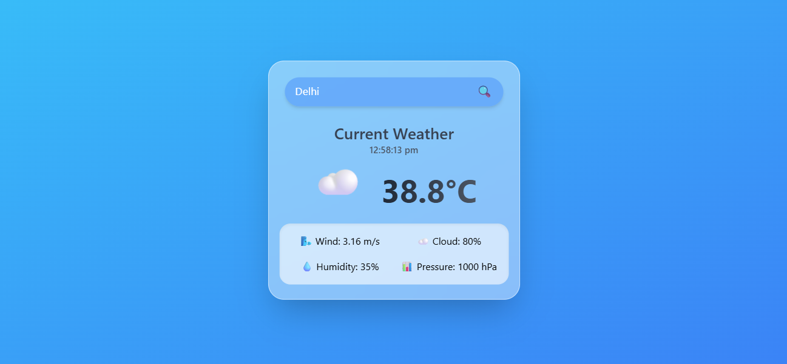

# 🌦️ Weather App

A simple and responsive weather application built using React.js that allows users to check real-time weather information of any city.

---

## 🚀 Live Demo
🔗 https://weather-app-sunny.vercel.app

---

## 📸 Screenshots




---

## 🛠️ Tech Stack

- ⚛️ React.js
- 🎨 CSS
- 🌐 OpenWeather API
- ▲ Vercel (Deployment)

---

## ✨ Features

- 🔍 Search weather by city name  
- 🌡️ Displays temperature  
- 💧 Shows humidity  
- 🌬️ Wind speed info  
- 📱 Fully responsive design  

---

## ⚙️ Installation & Setup

Follow these steps to run the project locally:

```bash
# Clone the repository
git clone https://github.com/sunny-kumar-dev/weather-app.git

# Navigate to project folder
cd weather-app

# Install dependencies
npm install

# Start the development server
npm start


---

## 🌐 Usage

- Enter any city name in the search bar  
- Click on search button  
- View real-time weather details like temperature, humidity, wind speed etc.

---

## 📁 Project Structure


weather-app/
├── public/
├── src/
├── assets/
├── package.json
└── README.md

---

## 🚀 Deployment

This project is deployed on **Vercel**

🔗 Live Link: https://weather-app-sunny.vercel.app

---

## 🙌 Contributing

Contributions are welcome!  
If you have suggestions or improvements:

1. Fork the repo  
2. Create your feature branch (`git checkout -b feature/AmazingFeature`)  
3. Commit your changes  
4. Push to the branch  
5. Open a Pull Request  

---

## 👨‍💻 Author

- Sunny Kumar  
- GitHub: https://github.com/sunny-kumar-dev  

---

## ⭐ Show your support

If you like this project, please give it a ⭐ on GitHub!
